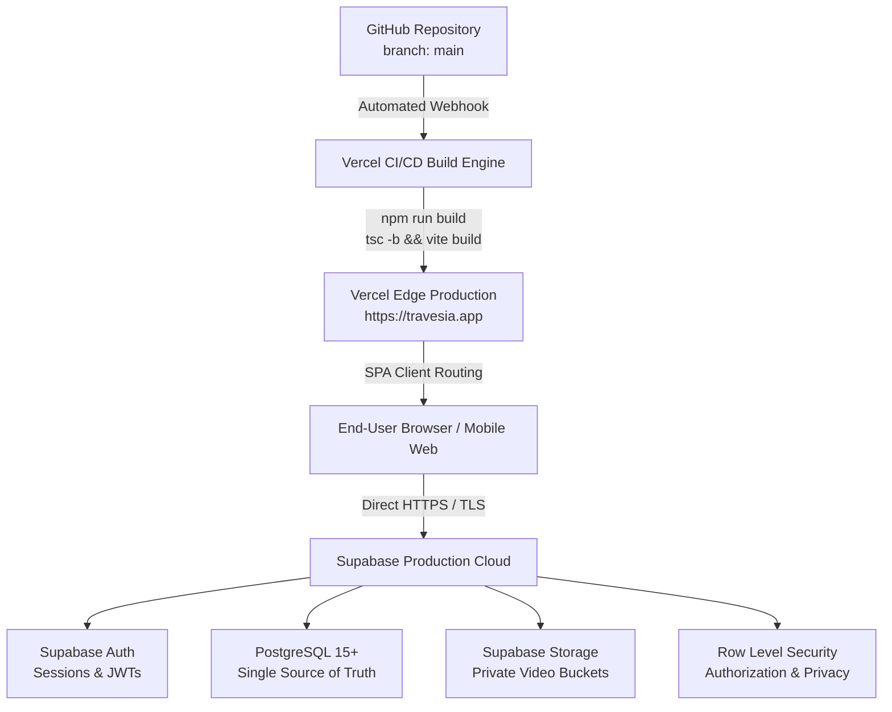
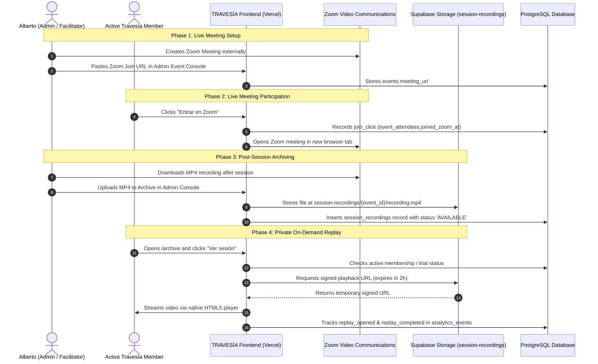

# TRAVESÍA — Deployment Architecture & Integration Map

> **Production Stack**:
> VERCEL = Application Hosting / CDN
> SUPABASE = Backend / Database / Authentication / Storage / RLS
> ZOOM = External Live Video Meetings

---

## 1. Application Deployment Pipeline

---

## 2. Live Session & Archive Recording Flow

TRAVESÍA is **not** a video-conferencing platform. Zoom hosts all live meetings.

---

## 3. Technology Stack Boundaries

| Domain | Technology | Role & Boundary | Prohibited Patterns |
|---|---|---|---|
| **Hosting & Edge** | Vercel | Global CDN, SPA delivery, HTTPS termination | No backend server state or cron jobs in hosting layer |
| **Database** | PostgreSQL (Supabase) | Single source of truth for all application data | No fake persistence, no localStorage as primary store |
| **Authentication** | Supabase Auth | Session management, password resets, JWT tokens | No fake or simulated auth state |
| **File Storage** | Supabase Storage | Video recordings, avatars, covers, resources | No public bucket for recordings |
| **Live Conferencing** | Zoom | Video meetings, audio transmission, screen sharing | Do NOT embed Zoom; Do NOT build native video rooms |
| **Client State** | React & TanStack Query | Reactive UI, optimistic mutations, server cache | React state is NOT the source of truth |

---

## 4. Architectural Verification Matrix

- [x] Supabase is the single source of truth for all persistent user data.
- [x] Production code never references `SUPABASE_SERVICE_ROLE_KEY`.
- [x] Journal data is private at the database RLS level.
- [x] Zoom meetings open in a new tab without fake video rooms.
- [x] `session-recordings` bucket is private with signed URL playback.
- [x] SPA routing configured in `vercel.json` to prevent 404 on refresh.
- [x] Dedicated `/health`, `/privacy`, and `/terms` routes available.
- [x] Full automated test suite passes with 100% test success.
